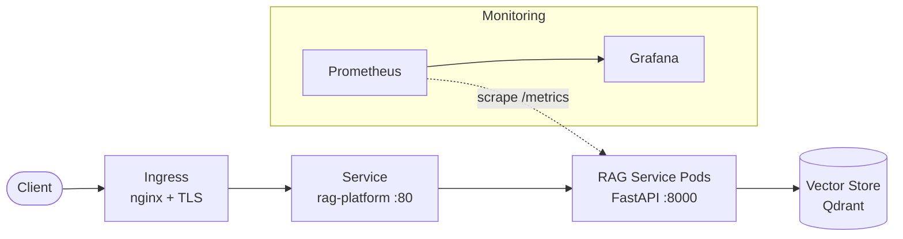

# RAG Platform on Kubernetes

A production-grade Retrieval-Augmented Generation (RAG) service — document ingestion, embedding, vector retrieval, and grounded answer generation — packaged as a FastAPI application and deployed on Kubernetes with Helm, Kustomize, and Prometheus/Grafana monitoring.

[](LICENSE)
[](https://github.com/abhisheksawant52/rag-platform-on-kubernetes/actions/workflows/ci.yml)
[](https://www.python.org/)
[](https://kubernetes.io/)
[](https://helm.sh/)

## Overview

RAG grounds a language model's answers in your own documents: relevant passages
are retrieved from a vector store and supplied to the generator so responses
cite real context instead of hallucinating. This repository provides both the
service (`rag_platform` Python package) and everything needed to run it in
production on Kubernetes.

The package is deliberately dependency-light at runtime and ships pluggable
`Embedder` and `VectorStore` interfaces, with dependency-free in-memory defaults
so it runs and tests out of the box, and drop-in production backends (Qdrant, a
real embedding model) selected via configuration.

## Architecture



**Components**

- **Ingress** — nginx + TLS, routes external traffic to the Service.
- **Service `rag-platform`** — ClusterIP on port `80`, targets container port `8000`.
- **RAG Service pods** — FastAPI app (`ghcr.io/your-org/rag-platform`) exposing
  `/health`, `/ready`, `/query`, `/ingest`, and `/metrics`.
- **Vector store** — Qdrant, holding embedded document chunks.
- **Prometheus + Grafana** — scrape `/metrics`, alert on error rate / latency,
  and visualise SLIs.

## Features

- Ingestion pipeline with configurable overlapping chunking.
- Pluggable embedding and vector-store backends behind typed `Protocol`s.
- Retrieval with similarity ranking and grounded answer generation.
- FastAPI with liveness/readiness probes and Prometheus metrics.
- Helm chart and Kustomize overlays (`dev`, `staging`, `production`).
- Hardened container: multi-stage build, non-root user, read-only root FS.
- Monitoring: alert rules, Grafana dashboard, and ServiceMonitor.

## Tech Stack

FastAPI · Uvicorn · Pydantic — Kubernetes · Helm · Kustomize — Prometheus ·
Grafana — Qdrant (vector store) — Docker — GitHub Actions.

## Getting Started

### Local development

```bash
make install                        # pip install -e ".[dev]"
uvicorn rag_platform.main:app --reload --port 8000
# then, in another shell:
curl http://localhost:8000/health
```

Run the checks:

```bash
make lint
make test
```

### Deploy to a cluster

**Helm**

```bash
helm install rag-platform helm/ \
  --namespace rag-production \
  --create-namespace \
  --set image.tag=<tag> \
  --set secrets.openaiApiKey=$OPENAI_API_KEY
```

**Kustomize**

```bash
kubectl apply -k kubernetes/overlays/dev
```

See [docs/deployment.md](docs/deployment.md) for the full walkthrough.

## Project Structure

```
.
├── src/rag_platform/         # FastAPI application package
│   ├── main.py               # create_app(); routes
│   ├── config.py             # Settings (RAGPLATFORM_*), get_settings()
│   ├── service.py            # RagService orchestration
│   ├── ingestion.py          # chunking + indexing
│   ├── embeddings.py         # Embedder protocol + HashingEmbedder
│   ├── vectorstore.py        # VectorStore protocol + InMemoryVectorStore
│   ├── retriever.py          # query embedding + ranked search
│   ├── generator.py          # grounded answer generation
│   └── models.py             # pydantic models
├── app/                      # reference FastAPI app (OpenAI/Qdrant integration)
├── helm/                     # Helm chart (Chart.yaml, values.yaml, templates/)
├── kubernetes/               # Kustomize base + overlays (dev/staging/production)
├── monitoring/               # Prometheus config + rules, Grafana dashboard, ServiceMonitor
├── argocd/                   # ArgoCD Application manifest
├── terraform/                # EKS + VPC + ECR infrastructure
├── docs/                     # architecture.md, deployment.md, runbooks/
├── tests/                    # pytest suite
├── Dockerfile                # multi-stage, non-root image
└── pyproject.toml
```

## Configuration

All settings are read from `RAGPLATFORM_*` environment variables (see
[.env.example](.env.example)).

| Variable | Default | Description |
|---|---|---|
| `RAGPLATFORM_APP_NAME` | `rag-platform` | Application name |
| `RAGPLATFORM_ENVIRONMENT` | `production` | Environment; disables `/docs` when `production` |
| `RAGPLATFORM_LOG_LEVEL` | `INFO` | Log level |
| `RAGPLATFORM_PORT` | `8000` | Container listen port |
| `RAGPLATFORM_VECTOR_STORE_URL` | `http://qdrant:6333` | Qdrant base URL |
| `RAGPLATFORM_COLLECTION_NAME` | `rag_documents` | Vector collection |
| `RAGPLATFORM_EMBEDDING_MODEL` | `text-embedding-3-small` | Embedding model |
| `RAGPLATFORM_EMBEDDING_DIM` | `384` | Embedding vector dimension |
| `RAGPLATFORM_LLM_MODEL` | `gpt-4o-mini` | Generation model |
| `RAGPLATFORM_TOP_K` | `5` | Chunks retrieved per query |
| `RAGPLATFORM_CHUNK_SIZE` | `512` | Tokens per chunk |
| `RAGPLATFORM_CHUNK_OVERLAP` | `64` | Overlap between chunks |

## Deployment

- **Helm** — chart at [`helm/`](helm) (deployment, service, ingress, HPA, PDB,
  serviceaccount, networkpolicy, secret, ServiceMonitor). Image
  `ghcr.io/your-org/rag-platform`, Service `rag-platform` on port `80` →
  container `8000`.
- **Kustomize** — [`kubernetes/base`](kubernetes/base) plus overlays
  [`dev`](kubernetes/overlays/dev), [`staging`](kubernetes/overlays/staging),
  and [`production`](kubernetes/overlays/production) (namespaces `rag-dev`,
  `rag-staging`, `rag-production`).
- **Monitoring** — [`monitoring/`](monitoring): Prometheus scrape config and
  alert rules, a Grafana dashboard, and a ServiceMonitor.

Full instructions: [docs/deployment.md](docs/deployment.md) and
[docs/runbooks/deployment.md](docs/runbooks/deployment.md).

## API

| Endpoint | Method | Description |
|---|---|---|
| `/health` | GET | Liveness probe |
| `/ready` | GET | Readiness probe (also `/readyz` for Helm probes) |
| `/metrics` | GET | Prometheus metrics |
| `/query` | POST | Submit a RAG query |
| `/ingest` | POST | Ingest documents |

## Contributing

Contributions are welcome — see [CONTRIBUTING.md](CONTRIBUTING.md) and our
[Code of Conduct](CODE_OF_CONDUCT.md).

## Security

Please report vulnerabilities per our [Security Policy](SECURITY.md).

## License

Licensed under the [MIT License](LICENSE).
