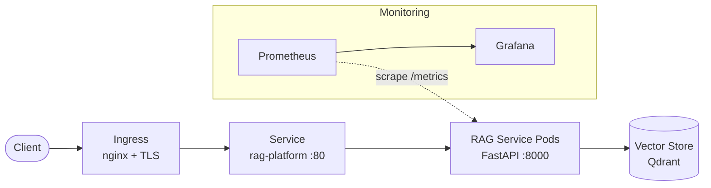

# Architecture

The RAG Platform is a FastAPI service that answers questions grounded in a
private document corpus. It is packaged for Kubernetes with a Helm chart,
Kustomize overlays, and Prometheus/Grafana monitoring.

## High-level flow

## Request paths

### Ingestion (`POST /ingest`)

1. Documents arrive at the API.
2. `DocumentIngestor` splits each document into overlapping token windows
   (`chunk_text`, controlled by `RAGPLATFORM_CHUNK_SIZE` /
   `RAGPLATFORM_CHUNK_OVERLAP`).
3. Chunks are embedded (`Embedder`) and upserted into the vector store
   (`VectorStore`).

### Query (`POST /query`)

1. The query is embedded.
2. `Retriever` performs a nearest-neighbour search and returns the top-k chunks
   ranked by similarity (`RAGPLATFORM_TOP_K`).
3. `TemplateGenerator` composes a grounded answer from the retrieved context.
4. The API returns the answer plus its source chunks.

## Components

| Layer | Module | Responsibility |
|---|---|---|
| API | `rag_platform.main` | FastAPI app factory; `/health`, `/ready`, `/query`, `/ingest` |
| Orchestration | `rag_platform.service` | `RagService` ties ingest + retrieve + generate together |
| Ingestion | `rag_platform.ingestion` | Chunking and indexing |
| Embeddings | `rag_platform.embeddings` | `Embedder` protocol; `HashingEmbedder` default |
| Vector store | `rag_platform.vectorstore` | `VectorStore` protocol; `InMemoryVectorStore` default |
| Retrieval | `rag_platform.retriever` | Query embedding + ranked search |
| Generation | `rag_platform.generator` | Grounded answer composition |
| Config | `rag_platform.config` | `Settings` (`RAGPLATFORM_*`), `get_settings()` |
| Models | `rag_platform.models` | Pydantic request/response and domain models |

## Design notes

- **Pluggable backends.** `Embedder` and `VectorStore` are `Protocol`s. The
  bundled `HashingEmbedder` and `InMemoryVectorStore` keep the package runnable
  and testable offline; production deployments inject Qdrant and a real
  embedding model without changing the pipeline.
- **Ports and names.** The container listens on `8000`; the Kubernetes Service
  exposes port `80` and targets container port `8000`. The image is
  `ghcr.io/your-org/rag-platform`. These values are kept consistent across the
  Dockerfile, Helm chart, and Kustomize manifests.
- **Observability.** Pods expose Prometheus metrics on `/metrics`; alert rules
  live in `monitoring/prometheus/rules/` and a dashboard in
  `monitoring/grafana/`.
